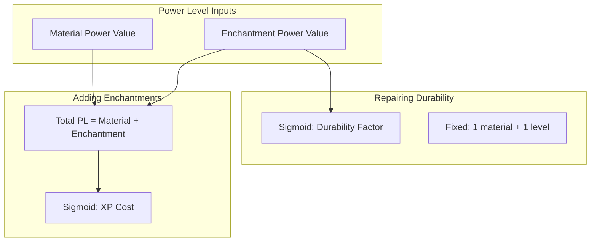

# Gear Maintenance and Modification — Implementation Plan

## Architecture Overview

---

## Reference Values (from [calculator-output.json](plan/power-level-calculator/calculator-output.json))

| Category                 | Values                                                                                                                                      |
| ------------------------ | ------------------------------------------------------------------------------------------------------------------------------------------- |
| **Materials**            | Wood 10, Stone 20, Copper 25, Gold 30, Iron 40, Diamond 70, Netherite 100                                                                   |
| **Non-material**         | Bow 70, Crossbow 40, Trident 45, Fishing Rod 20, Shield 40, Elytra 55, Shears 35, Carrot on a Stick 15, Warped Fungus on a Stick 18, Book 0 |
| **Enchant cost sigmoid** | min 3, max 50, x0 255, k 0.025                                                                                                              |
| **Repair sigmoid**       | min 0.33, max 1.1, midpoint 55, steepness 0.035                                                                                             |

---

## Implementation Order

### Phase 1: Core — Power Level Inputs

**1.1 Create data model and registries**

- **File**: `src/main/java/.../power/PowerLevelConfig.java`  
  - Hold material power values, enchantment per-level power values, and sigmoid parameters (enchant cost + repair).
  - Load defaults from values matching [calculator-output.json](plan/power-level-calculator/calculator-output.json).
  - Optional: support loading from a JSON config file (e.g. `config/gear_maintinence_and_modification.json`).
- **File**: `src/main/java/.../power/PowerLevelCalculator.java`  
  - `computeMaterialPowerValue(ItemStack)` → material power value (base tier or fixed value for non-tiered items).
  - `computeEnchantmentPowerValue(ItemStack)` → enchantment power value only (excludes material).
  - `computeTotalPowerValue(ItemStack)` → material + enchantment (for enchant/combine cost).
  - Map `Item` → material via `Tier` (e.g. `Item.getTier()`) or explicit item→material map for 1.21.
  - Map `Enchantment` + level → power value via registry key lookup.

**1.2 Item and enchantment mapping**

- Map tiered items (swords, axes, pickaxes, shovels, hoes, spears, maces, armor) to materials via `Tier` or item tags.
- Map non-tiered items (bow, crossbow, trident, fishing rod, shield, elytra, shears, carrot on a stick, warped fungus on a stick, book) to fixed material power values.
- Map all 1.21 enchantments to per-level power values from the preset; unknown enchantments default to a small value (e.g. 4).

---

### Phase 2: Sigmoid and Cost Logic

**2.1 Formula utilities**

- **File**: `src/main/java/.../power/AnvilCostFormulas.java`  
  - `enchantCostFromPL(totalPL)` → `ceil(minCost + (maxCost - minCost) / (1 + e^(-k × (totalPL - x0))))` — uses total power value (material + enchantment) of the resulting item.
  - `durabilityRepairFactor(enchantmentPowerValue)` → `minRepair + (maxRepair - minRepair) / (1 + e^(k × (enchantmentPowerValue - x0)))` — uses enchantment power value only.
  - Use config values for min, max, x0, k.

---

### Phase 3: Anvil Integration (Mixin)

**3.1 Target**: `net.minecraft.world.inventory.AnvilMenu`

- **Method**: `createResult()` — computes result item, level cost, and `repairItemCountCost`.
- **Strategy**: `@Inject` at `TAIL` of `createResult()` to override cost and repair behavior after vanilla logic runs.

**3.2 Mixin implementation**

- **File**: `src/main/java/.../mixin/AnvilMenuMixin.java`  
  - `@Shadow` access to: `cost` (DataSlot), `repairItemCountCost`, input slots (via `ItemCombinerMenu`).
  - At TAIL of `createResult()`:
    1. Get left item, right item, result item from slots.
    2. Determine operation type: **rename only**, **repair** (item + material), **enchant** (item + book), or **combine** (item + item).
    3. Compute and apply our costs and durability:

| Operation      | Level cost                                                    | Material cost | Durability                                     |
| -------------- | ------------------------------------------------------------- | ------------- | ---------------------------------------------- |
| Rename only    | Keep vanilla or minimal (e.g. 1)                              | 0             | N/A                                            |
| Repair         | 1                                                             | 1             | Sigmoid on left item's enchantment power value |
| Enchant (book) | Sigmoid on total PL (left material + left enchantment + book) | 0             | N/A                                            |
| Combine        | Sigmoid on total PL (left + right material and enchantment)   | 0             | Sigmoid on left item's enchantment power value |

- **Durability scaling**:  
  - `vanillaRestored = leftDamage - resultDamage` (what vanilla would restore).  
  - `ourRestored = (int)(vanillaRestored * durabilityRepairFactor(enchantmentPL))`.  
  - Set result damage: `leftDamage - ourRestored`.
- **Cost**: Set `cost.set(...)` and `repairItemCountCost = ...` to our computed values.

**3.3 Edge cases**

- Empty slots: no change.
- Incompatible enchants: keep vanilla behavior (or apply penalty per plan).
- Rename-only: cost = 1 level (or keep vanilla).

---

### Phase 4: Config and Polish

**4.1 Configuration (optional)**

- Use Fabric’s config API or a simple JSON loader.
- Expose: material values, enchant values, sigmoid parameters.
- Allow preset loading (e.g. from calculator-output.json).

**4.2 Cleanup**

- Remove `ExampleMixin` and `ExampleClientMixin`.
- Update [fabric.mod.json](src/main/resources/fabric.mod.json): name, description, authors.
- Update [gear_maintinence_and_modification.mixins.json](src/main/resources/gear_maintinence_and_modification.mixins.json): register `AnvilMenuMixin`, remove `ExampleMixin`.

---

## Key Files Summary

| File                              | Purpose                                                |
| --------------------------------- | ------------------------------------------------------ |
| `power/PowerLevelConfig.java`     | Model values, sigmoid params, load/save                |
| `power/PowerLevelCalculator.java` | Raw value and power level computation                  |
| `power/AnvilCostFormulas.java`    | Sigmoid cost and repair factor formulas                |
| `mixin/AnvilMenuMixin.java`       | Override anvil cost and durability in `createResult()` |

---

## Minecraft 1.21.10 API Notes

- **AnvilMenu** (`net.minecraft.world.inventory.AnvilMenu`): `createResult()`, `cost` (DataSlot), `repairItemCountCost`.
- **ItemCombinerMenu**: input slots via `getSlot(int)` or slot definitions.
- **Tier**: Use `Tier` for tiered tools/armor; map to material raw values.
- **Enchantment**: Use `BuiltInRegistries.ENCHANTMENT` and registry ID for lookup.

---

## Testing Checklist

- Unenchanted diamond sword repair: 1 material, 1 level, ~1.1× vanilla durability.
- Heavily enchanted sword repair: 1 material, 1 level, reduced durability (~0.33×).
- Book + item enchant: cost follows sigmoid (low PL ~3, high PL ~50).
- Two swords combine: cost = sigmoid(rawLeft + rawRight); durability = Branch A on left enchantment PL.
- Rename only: minimal cost.

